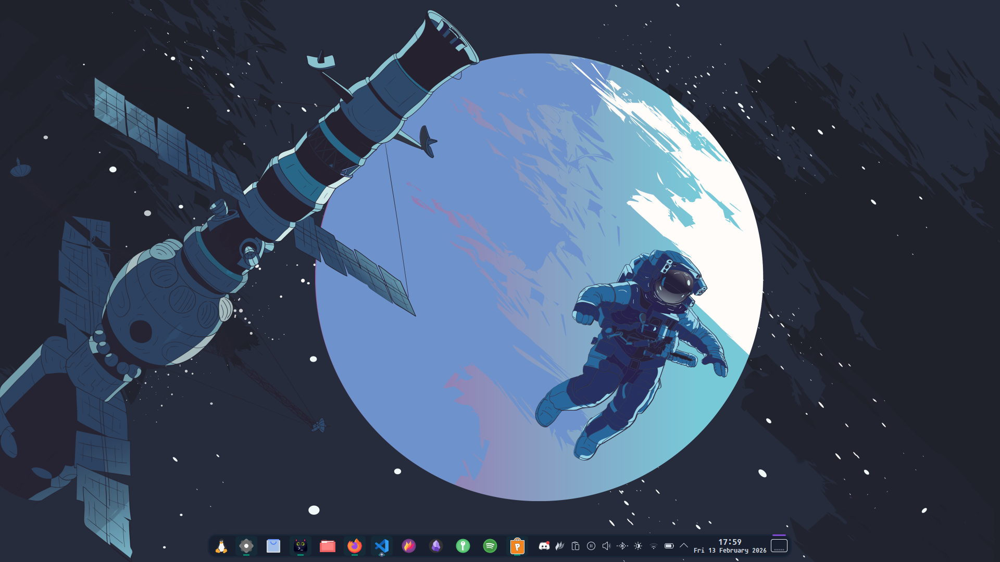
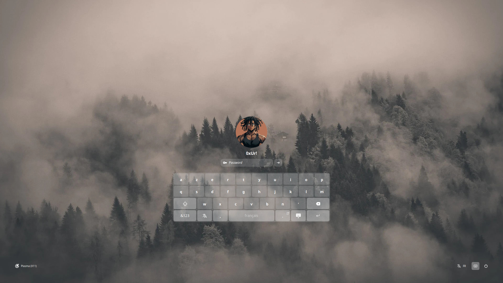
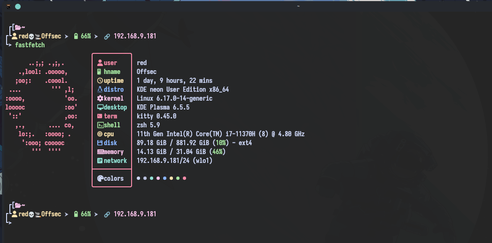
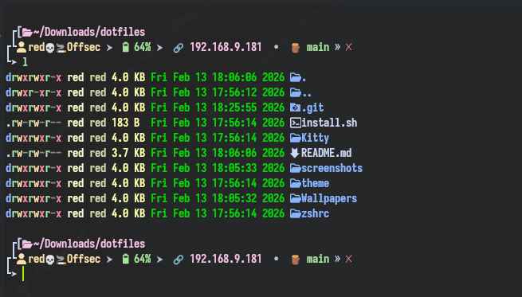
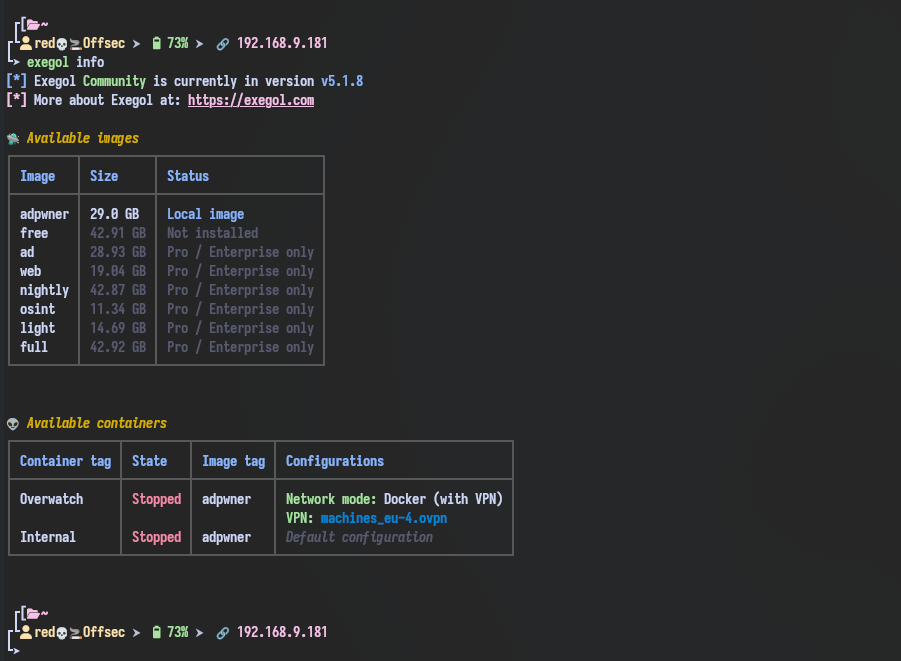

# 0xUri3l's Dotfiles

My personal Linux setup for pentesting & daily use.



## Screenshots

### SDDM Login


### Terminal


### ZSH Theme


### Exegol


## Details

| Component | Value |
|-----------|-------|
| **OS** | KDE neon (Plasma 6.5.5) |
| **WM** | KWin |
| **Display Manager** | SDDM ([SilentSDDM](https://github.com/uiriansan/SilentSDDM.git)) |
| **Terminal** | [Kitty](https://sw.kovidgoyal.net/kitty/) |
| **Shell** | ZSH 5.9 |
| **Theme** | Catppuccin Mocha (Kitty) / Dracula-alt-style (GTK) |
| **Icons** | Fluent-red-dark |
| **Font** | Iosevka Nerd Font |
| **Pentest Env** | [Exegol](https://exegol.com) (Docker-based, replaces Kali) |

## What's included

```
dotfiles/
├── Kitty/
│   ├── kitty.conf          # Kitty terminal config
│   ├── kitty.png           # Kitty application logo
│   └── kitty-themes/       # 380+ color themes
├── theme/
│   └── 0xUri3l.zsh-theme   # Custom ZSH prompt
├── zshrc/
│   └── .zsh_aliases        # Shell aliases
├── Wallpapers/
│   ├── wallhaven-lyz3d2.png  # Old wallpaper
│   └── wallhaven-e76pew.png  # Current desktop wallpaper (space theme)
├── screenshots/
└── install.sh
```

### Kitty

- Catppuccin Mocha colorscheme with custom dark background (`#252525`)
- Beam cursor with trail effect
- Lime-green (`#9fef00`) accents (cursor, selection, active tab)
- 98% background opacity
- 380+ bundled themes to switch from
- Kitty logo included (`kitty.png`) — to use it as window logo, uncomment `window_logo_path` in `kitty.conf`

### ZSH Theme (`0xUri3l`)

A multi-line prompt with:
- Battery status with charge icons
- Network interface detection (Ethernet / WiFi / VPN)
- Git branch + status (clean/dirty/needs push)
- Command execution time (for long running commands)
- Pyenv version display

### Aliases

Shortcuts for navigation, system updates, VPN management, network scanning, pivoting (Ligolo-NG), CTF platforms (HackTheBox, Vulnlab), report setup, and more.

### SDDM Theme

Using [SilentSDDM](https://github.com/uiriansan/SilentSDDM.git) - a minimalist login theme with a misty forest background.

To install:
```bash
git clone https://github.com/uiriansan/SilentSDDM.git
sudo cp -r SilentSDDM /usr/share/sddm/themes/
sudo nano /etc/sddm.conf  # Set Current=SilentSDDM under [Theme]
```

## Prerequisites

Install a [Nerd Font](https://www.nerdfonts.com/) for the icons to render properly. This setup uses **Iosevka Nerd Font**:

```bash
# Download from https://www.nerdfonts.com/font-downloads
# Or via package manager, e.g.:
sudo apt install fonts-iosevka-nerd

# Alternatively, download and install manually:
mkdir -p ~/.local/share/fonts
cd ~/.local/share/fonts
wget https://github.com/ryanoasis/nerd-fonts/releases/latest/download/Iosevka.zip
unzip Iosevka.zip -d Iosevka
fc-cache -fv
```

You also need these tools:
- [lsd](https://github.com/lsd-rs/lsd) (aliased as `ls`)
- [batcat](https://github.com/sharkdp/bat) (aliased as `bat`)
- [fastfetch](https://github.com/fastfetch-cli/fastfetch) (system info - using `examples/13.jsonc` theme)
- [Oh My ZSH](https://ohmyz.sh/) or a ZSH framework that supports custom themes

## Installation

1. Clone the repo:

```bash
git clone https://github.com/0xUri/dotfiles.git
cd dotfiles
```

2. Run the install script:

```bash
chmod +x install.sh
./install.sh
```

3. Add this to your `~/.zshrc` to load the aliases:

```bash
if [ -f ~/.zsh_aliases ]; then
    source ~/.zsh_aliases
fi
```

4. Copy the ZSH theme to your themes directory (for Oh My ZSH):

```bash
cp theme/0xUri3l.zsh-theme ~/.oh-my-zsh/custom/themes/
```

Then set `ZSH_THEME="0xUri3l"` in your `~/.zshrc`.

5. Reload your shell:

```bash
source ~/.zshrc
```
